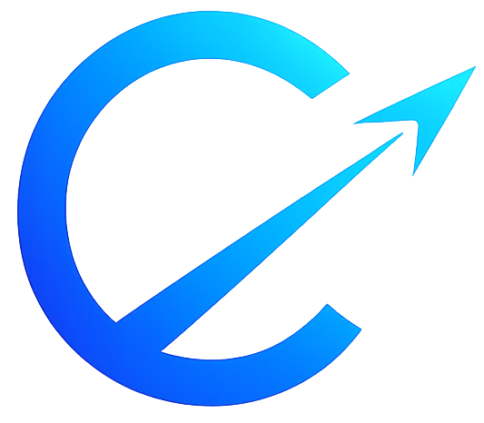

<div align="center">



# Cinova

**Weekly, monthly, and yearly goals — confronting you every new tab.**

[](https://developer.chrome.com/docs/extensions/)
[](https://developer.chrome.com/docs/extensions/mv3/intro/)
[](https://react.dev)
[](https://www.typescriptlang.org/)
[](https://vitejs.dev)

</div>

---

Replace your browser's new tab with a focused goal dashboard. Every tab open puts your goals front and center — no accounts, no backend, everything stored in `chrome.storage.sync`.

<br />

<div align="center">
  
</div>

---

## Features

### Goals
- **Three timeframes** — weekly, monthly, and yearly goals on one screen
- **Inline completion** — check off goals without leaving the new tab
- **Notes per goal** — add context, links, and resources to any goal
- **Expandable descriptions** — click a goal's note preview to read the full text
- **Clickable links** — URLs in notes render as `↗ hostname` links, always visible below the goal
- **Up to 10 goals** per timeframe
- **Weekly auto-reset** — weekly goals uncheck when a new ISO week begins

### Background
- **Auto-rotate** — cycles through 8 curated landscapes, one new image per week
- **Manual pick** — click any thumbnail in Settings to lock in a specific image
- **Custom image** — paste any direct image URL to use your own background
- **Live preview** — see the result before saving
- **Blur + dark overlay** — text stays readable over any background

### Interface
- **Resizable sidebar** — drag the edge to your preferred width; persists across sessions
- **Live clock** — large monospace HH:MM display with running seconds
- **Week tracker** — 7-day bar showing exactly where you are in the current week
- **Google Search** — search bar built into the dashboard
- **Grid / list view** — toggle layout on the Goals editing page
- **Unsaved changes guard** — full-screen modal on both Goals and Settings pages prevents accidental data loss

---

## Screenshots

### Goals


---

### Settings


---

## Installation

Cinova is not on the Chrome Web Store yet — load it manually as an unpacked extension.

### Prerequisites

- Node.js 18+
- Chrome or Brave browser

### Steps

**1. Clone and build**

```bash
git clone https://github.com/your-username/cinova.git
cd cinova
npm install
npm run build
```

**2. Load in Chrome / Brave**

1. Open `chrome://extensions` (or `brave://extensions`)
2. Enable **Developer mode** — top-right toggle
3. Click **Load unpacked**
4. Select the `dist/` folder inside the project directory

**3. Open a new tab**

Cinova replaces your new tab page immediately.

---

## Usage

### New Tab

Goals appear in the left sidebar, grouped by timeframe. Click a **checkbox** to complete a goal. Click the **muted note text** below a goal to expand its full description. URLs in notes appear as `↗ hostname` links and open in a new tab.

Use the **pencil icon** (top-right of the sidebar) to edit goals. Use the **gear icon** (sidebar footer) to open Settings.

### Goals page

Add, edit, and remove goals for each timeframe. Each goal has a notes field — paste URLs there and they become clickable links in the sidebar. Toggle **grid / list** layout with the icon in the header. Click **Save changes** to persist. Navigating away with unsaved edits shows a confirmation modal.

### Settings page

Pick between **Auto-rotate** (weekly curated landscapes) and **Custom** (paste your own image URL) background modes. In Auto-rotate, click any thumbnail to lock in a specific image. A **live preview** shows the result. Use **Reset weekly progress** to uncheck all weekly goals without deleting them.

---

## Development

```bash
npm install       # install dependencies
npm run dev       # Vite dev server (component preview only — not the extension)
npm run build     # production build → dist/
```

After any code change, run `npm run build` then click the **refresh icon** on the Cinova card in `chrome://extensions`.

### Project structure

```
src/
├── newtab/      # New tab dashboard (sidebar + clock + search)
├── options/     # Goals editing page
├── settings/    # Settings page (background, weekly reset)
├── utils/       # chrome.storage.sync helpers
└── types/       # Shared TypeScript interfaces
public/
├── manifest.json
└── CinovaLogo.png
```

---

## Tech Stack

| Layer | Technology |
|---|---|
| Framework | React 19 + TypeScript 6 |
| Build tool | Vite 8 (multi-page) |
| Extension API | Chrome Manifest V3 |
| Storage | `chrome.storage.sync` |
| Styling | Inline styles |
| Icons | Lucide React |
| Fonts | Space Grotesk, Space Mono |

---

## License

MIT
